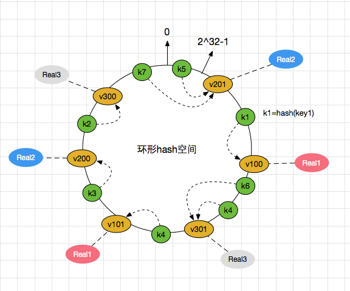

存在一种场景, 当一个缓存服务由多个服务器组共同提供时, key应该路由到哪一个服务。这里假如采用最通用的方式取模求余: `key%N`(N为服务器数目), 这样做均衡性没有什么问题, 但是当服务器数目发送增加或减少时, 分配方式则变为`key%(N+1)`或`key%(N-1)`。这里将会有大量的key失效迁移, 如果后端key对应的是有状态的存储数据,那么毫无疑问,这种做法将导致服务器间大量的数据迁移,从而造成服务的不稳定。解决思路，采用一致性哈希方法可以解决此问题。 

<!--more-->

## 应用场景 
1.分布式负载均衡;
2.过渡平滑(如给分布式集群分发数据, 当分布式集群动态增删时,可尽量减少数据迁移,减少受影响的数据);
3.分布式缓存均衡(对缓存节点进行扩缩容, 原理如上述2);

## 算法原理

一致性哈希算法在1997年由麻省理工学院提出的一种分布式哈希(DHT)实现算法，设计目标是为了解决因特网中的热点(Hot spot)问题，初衷和CARP十分类似。一致性哈希修正了CARP使用的简 单哈希算法带来的问题，使得分布式哈希(DHT)可以在P2P环境中真正得到应用。 

一致性hash算法提出了在动态变化的Cache环境中，判定哈希算法好坏的四个定义:

1.`平衡性(Balance)`: 平衡性是指哈希的结果能够尽可能分布到所有的缓冲中去，这样可以使得所有的缓冲空间都得到利用。很多哈希算法都能够满足这一条件。

2.`单调性(Monotonicity)`: 单调性是指如果已经有一些内容通过哈希分派到了相应的缓冲中，又有新的缓冲加入到系统中。哈希的结果应能够保证原有已分配的内容可以被映射到原有的或者新的缓冲中去，而不会被映射到旧的缓冲集合中的其他缓冲区。 

3.`分散性(Spread)`: 在分布式环境中，终端有可能看不到所有的缓冲，而是只能看到其中的一部分。当终端希望通过哈希过程将内容映射到缓冲上时，由于不同终端所见的缓冲范围有可能不同，从而导致哈希的结果不一致，最终的结果是相同的内容被不同的终端映射到不同的缓冲区中。这种情况显然是应该避免的，因为它导致相同内容被存储到不同缓冲中去，降低了系统存储的效率。分散性的定义就是上述情况发生的严重程度。好的哈希算法应能够尽量避免不一致的情况发生，也就是尽量降低分散性。 

4.`负载(Load)`: 负载问题实际上是从另一个角度看待分散性问题。既然不同的终端可能将相同的内容映射到不同的缓冲区中，那么对于一个特定的缓冲区而言，也可能被不同的用户映射为不同 的内容。与分散性一样，这种情况也是应当避免的，因此好的哈希算法应能够尽量降低缓冲的负荷。

在分布式集群中，对机器的添加删除，或者机器故障后自动脱离集群这些操作是分布式集群管理最基本的功能。如果采用常用的hash(object)%N算法，那么在有机器添加或者删除后，很多原有的数据就无法找到了，这样严重的违反了单调性原则。在移除/添加一个cache时，利用一致性哈希算法能够尽可能小的改变已存在key映射关系，尽可能的满足单调性的要求。

下面就来按照5个步骤简单讲讲 consistent hashing 算法的基本原理:

** 1 环形hash空间 **

考虑通常的hash算法都是将value映射到一个32位的key值, 也即是0~2^32-1次方的数值空间上; 可以将这个空间想象成一个首(0)尾(2^32-1)相接的圆环, 如图1所示,

<center><br>图1 环形hash空间</center>

** 2 把对象映射到hash空间 **

接下来考虑4个对象key1~key4，通过hash函数计算出的hash值key在环上的分布如图2所示,

hash(key1) = k1;
… …
hash(key4) = k4;

<center>图2 4个对象的key哈希值分布</center>

** 3 把cache server映射到hash空间 **

一致性哈希算法的基本思想就是将对象和cache server都映射到同一个hash数值空间中，并且使用相同的hash算法。

同样, 假设当前有3台cache server，把缓存服务器通过hash算法，加入到上述的环中。

hash(cache1) = c1;
… …
hash(cache3) = c3;

<center>图3 cache server 和对象的key哈希值分布</center>

<font color=red>通常cache server的hash计算, 是用cache机器的IP地址或机器名作为hash输入, 后继的实现案例中利用了cache server的IP地址作为参数因子。</font>

** 4 把对象映射到cache server上 **

接下来就是数据如何存储到cache服务器上了，key值哈希之后的结果顺时针找上述环形hash空间中，距离自己最近的机器节点，然后将数据存储到上面， 如上图所示，k1 存储到 c3 服务器上， k4,k3存储到c1服务器上， k2存储在c2服务器上。用图表示如下：

<center>图4 cache server 和对象的key哈希值映射</center>

** 5 考察cache server的变动 **
前面讲过，通过hash求余的方法带来的最大问题就在于不能满足单调性，当cache server有所变动时，存储在原位置上的cache数据失效了，就需要做相应的迁移, 进而对后台服务器造成巨大的冲击，现在就来分析一致性哈希算法,

5.1 移除cache server 

假设cache3服务器宕机，这时候需要从集群中将其摘除。那么，之前存储在c3上的k1，将会顺时针寻找距离它最近的一个节点，也就是c1节点，这样，k1就会存储到c1上了，看一看下下面的图，比较清晰。

<center>图4 Cache server 3被移除后的cache server映射</center>

<font color=red>摘除c3节点之后，只影响到了原先存储再c3上的k1，而k3、k4、k2都没有受到影响，也就意味着解决了最开始的解决方案（hash(key)%N）中可能带来的雪崩问题。</font>

5.2 添加cache server

新增C4节点之后，原先存储到C1的k4，迁移到了C4，分担了C1上的存储压力和流量压力。

<center>图5 添加cache server 4后的映射关系</center>

为什么需要想象成环形？

为了保证节点宕机摘除之后，原先存储在当前节点的key能找到可存储的位置。举个极端的例子，在不是环状hash空间下，刚好缓存的服务器处于0这个位置，那么0之后是没有任何节点信息的，那么当缓存服务器摘除的时候，以前存储在这台机器上的key便找不到顺时针距离它最近的一个节点了。但如果是环形空间，0之后的最近的一个节点信息有可能是2^32-1这个位置，他可以找到0之后的节点。如下图描述可能清晰一点。

<center>图6 why hash环</center>

为什么是2^32个桶空间？
桶空间的大小根据选用的hash算法来定, 一般情况下, hash的返回结果为32位的整型数据, 无符号的整型的最大值是2^32-1, 最小值是0, 一共2^32个数字, 所有, 桶空间也就是2^32个了; 

上面的简单的一致性hash的方案在某些情况下但依旧存在问题：一个节点宕机之后，数据需要落到距离他最近的节点上，会导致下个节点的压力突然增大，可能导致雪崩，整个服务挂掉。如下图所示，

<center>图7 摘除c3服务器</center>

当节点C3摘除之后，之前再C3上的k1就要迁移到C1上，这时候带来了两部分的压力:

     1)、之前请求到C3上的流量转嫁到了C1上,会导致C1的流量增加，如果之前C3上存在热点数据，则可能导致C1扛不住压力挂掉。

     2)、之前存储到C3上的key值转义到了C1，会导致C1的内容占用量增加，可能存在瓶颈。

当上面两个压力发生的时候，可能导致C1节点也宕机了。那么压力便会传递到C2上，又出现了类似滚雪球的情况，服务压力出现了雪崩，导致整个服务不可用。

那怎么解决这个问题呢？ 引入虚拟节点, 

** 6 虚拟节点 **

考量Hash算法的另一个指标是`平衡性(Balance)`，定义如下:
** 平衡性 ** 是指哈希的结果能够尽可能分布到所有的缓冲中去，这样可以使得所有的缓冲空间都得到利用, hash算法并不是保证绝对的平衡，如果cache server较少的话，对象并不能被均匀的映射到cache server上，比如在上面的例子中，仅部署cache server 1 和 cache server 3的情况下，在4个对象中，cache server 1仅存储了key1，而cache server 3则存储了key2, key3和key4; 分布是很不均衡的。

如上描述，一个节点宕机之后可能会引起下个节点的存储及流量压力变大，这一点违背了最开始提到的四个原则中的 平衡性， 节点宕机之后，流量及内存的分配方式打破了原有的平衡。

虚拟节点，从名字可以看出来，这个节点是个虚拟的，每个实际节点对应多个虚拟节点。比较专业的说法如下：

“虚拟节点”（ virtual node ）是实际节点（机器）在 hash 空间的复制品（ replica ），一实际个节点（机器）对应了若干个“虚拟节点”，这个对应个数也成为“复制个数”，“虚拟节点”在 hash 空间中以hash值排列。

依旧用图片来解释，假设存在以下的真实节点和虚拟节点的对应关系。

Visual100—> Real1

Visual101—> Real1

Visual200—> Real2

Visual201—> Real2

Visual300—> Real3

Visual301—> Real3

同样的，hash之后的结果如下：

hash(Visual100)—> V100  —> Real1

hash(Visual101)—> V101  —> Real1

hash(Visual200)—> V200  —> Real2

hash(Visual201)—> V201  —> Real2

hash(Visual300)—> V300  —> Real3

hash(Visual301)—> V301  —> Real3

key值的hash结果如上，这里暂时不写了。

如图解释：

<center>图8 虚拟节点</center>

和之前介绍的不添加虚拟节点的类似，主要聊下如果宕机之后的情况。 

假设Real1机器宕机，则会发生一下情况。

1、原先存储在虚拟节点V100上的k1数据将迁移到V301上，也就意味着迁移到了Real3机器上。 

2、原先存储再虚拟节点V101上的k4数据将迁移到V200上，也就意味着迁移到了Real2机器上。

结果如下图：

<center>图8 虚拟节点</center>

这个就解决之前的问题了，某个节点宕机之后，存储及流量压力并没有全部转移到某台机器上，而是分散到了多台节点上。解决了节点宕机可能存在的雪崩问题。

当物理节点多的时候，虚拟节点多，这个的雪崩可能就越小。

## 算法实现

上面详细讲述了一致性哈希算法的原理，下面通过golang语言来实现一致性哈希算法，具体实现思想: 
1.通过一致性哈希函数将这些cache server映射到一个哈希环上，并将这个哈希环按升序排序;
2.将待写入到cache server中的key-value值对象，可以用这个对象的key作为因子用上述同一个一致性哈希函数计算出一个hash值，然后按顺时针在哈希环上找到第一个大于这个hash值的cache server hash值;
3.通过找到的这个cache server hash值可以找到对应的cache server;
4.然后将上述的key-value对象存入到这个cache server中。 

具体实现过程大致可以分为一下几个步骤:

1.定义cache server节点实体, 用于计算cache server节点hash值的字符串;
2.定义一致性哈希结构，用于构建cache server的哈希环;
3.定义添加哈希节点的函数;
4.定义获取哈希节点的函数;
5.定义删除哈希节点的函数。

1.定义cache server节点实体,
```golang
type Node struct {
  Id       int
  Ip       string
  Port     int
  HostName string
  Weight   int
}
```

上面定义了一个cache server node的实体, 作用是用于计算代表cache server node的唯一hash值, 在本程序中将采用缓存服务器的Id, IP, Weight以及虚拟节点Id作为计算字符串，说明如下:

`Id`: 缓存服务器节点id 
`Ip`: 缓存服务器ip
`Port`: 缓存服务器port
`HostName`: 缓存服务器主机名(unique) 
`Weight`: 缓存服务器权重

2.定义一致性哈希结构，

```golang
type Consistent struct {
  Nodes     map[uint32]Node
  numReps   int
  Resources map[int]bool
  ring      HashRing
  sync.RWMutex
}
```

上面定义了一致性哈希结构，说明如下,

`Nodes`: 用于保存所有的hash-cache server node 映射关系
`numReps`: 复制个数, 用于设置每个物理节点所虚拟的个数，即每个物理节点最后虚拟出多少个节点个数
`Resources`: 用于标识当前物理节点是否已经被映射过了 
`ring`: 是一个切片数组， 用于保存所有的虚拟节点，即上面`Nodes`中的所有`key`值，可以通过这个`key`值到`Nodes`中去取对应的cache server信息，这个切片数组是排序过的，可以想象成一个环，及所谓的hash 环。
`sync.RWMutex`: 读写锁，全部数据操作一致性。

3.定义添加哈希节点函数, 用于构建哈希环
```golang
func (c *Consistent) Add(node *Node) bool {
	c.Lock()
	defer c.Unlock()

	if _, ok := c.Resources[node.Id]; ok {
		return false
	}

	count := c.numReps * node.Weight
	for i := 0; i < count; i++ {
		str := c.joinStr(i, node)
		c.Nodes[c.hashStr(str)] = *(node)
	}
	c.Resources[node.Id] = true
	c.sortHashRing()
	return true
}
```
上述添加哈希节点过程其实就是在计算一个一个cache server node的hash值，并构建排序过的哈希环， 大致分为以下几步:
1.检查当前物理节点是否已经被映射到哈希环上了，没有则进入下一步，
2.根据权重值计算出本物理节点的最终虚拟节点个数，然后分别计算对应虚拟节点的hash值,保存到`Nodes`结构中，
3.构建哈希环并排序，

4.定义获取哈希节点的函数, 用于将待存储的热点值存入到对应的cache server上,
```golang
func (c *Consistent) Get(key string) Node {
	c.RLock()
	defer c.RUnlock()

	hash := c.hashStr(key)
	hit_index := c.search(hash)

	return c.Nodes[c.ring[hit_index]]
}
```

大致过程，
1.计算对象key的hash值，
2.根据上面计算的hash值，用二分搜索法到哈希环搜索自上述hash值起离它最近的一个cache server node hash值节点key，
3.根据查找到的cache server节点key, 返回`Nodes`结构中存储的cache sever信息，

5.定义删除哈希节点的函数, 当某个cache server 挂掉之后，用于删除这个节点(一般情况下不建议删除节点，而是将当前坏节点上的数据迁移到好的节点上)
```golang
func (c *Consistent) Remove(node *Node) {
	c.Lock()
	defer c.Unlock()

	if _, ok := c.Resources[node.Id]; !ok {
		return
	}

	delete(c.Resources, node.Id)

	count := c.numReps * node.Weight
	for i := 0; i < count; i++ {
		str := c.joinStr(i, node)
		delete(c.Nodes, c.hashStr(str))
	}
	c.sortHashRing()
}
```

大致过程，
1.判断待删除物理节点是否存在哈希环中，存在则删除，并进入下一步，
2.删除改物理节点映射在哈希环中的所有虚拟节点,
3.重新排序哈希环,


至此一致性哈希算法基本实现， 详细代码请参见 https://github.com/researchlab/experiments/tree/master/consistent_hash

## 总结
- 详细阐述了一致性哈希算法实现原理及适合场景
- 采用slice + sort 方式构建哈希环，并用golang实现了一致性哈希算法
- 可以尝试采用红黑树的方式来构建哈希环，在性能上可能更好，有待进一步尝试 
