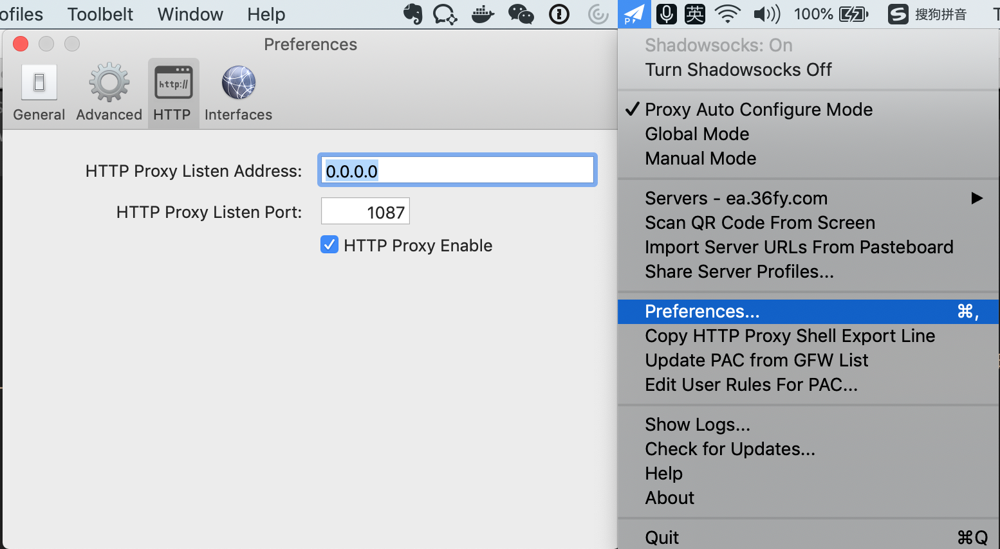

在mac上利用minikube 搭建k8s环境或多或少会因为pull镜像失败而搭建不成功, 本文介绍两种在mac上利用minikube 搭建k8s环境的方法; 一种是通过VPN翻墙利用官方minikube 搭建k8s 环境， 另外一种是借助阿里云的minikube版本来搭建k8s环境;
<!--more-->


## 利用官方minikube搭建k8s环境

1 安装minikube 

```
brew cask install minikube virtualbox
```

2 设置VPN



3 编写执行脚本 run.sh

```shell
#!/bin/bash
minikube delete && minikube start --cpus=2 --memory=4096 --disk-size=10g \
	--docker-env http_proxy=本机IP:1087 \
	--docker-env https_proxy=本机IP:1087 \
	--docker-env no_proxy=192.168.99.0/24
```

其中`本机IP` 可通过如下命令获得

```shell
> ifconfig |grep inet |grep -v 127.0.0.1
	inet6 fe80::cf3:df1b:2dc0:6e96%en0 prefixlen 64 secured scopeid 0x5
	inet 192.168.11.234 netmask 0xffffff00 broadcast 192.168.11.255
	inet6 fe80::71:c740:8d33:ce8f%utun1 prefixlen 64 scopeid 0xc
	inet 192.168.99.1 netmask 0xffffff00 broadcast 192.168.99.255
```

4 执行脚本启动minikube 搭建k8s

> 执行脚本时 记得已开启VPN 

```shell
➜  sh run.sh
There is a newer version of minikube available (v1.3.0).  Download it here:
https://github.com/kubernetes/minikube/releases/tag/v1.3.0

To disable this notification, run the following:
minikube config set WantUpdateNotification false
🔥  Deleting "minikube" from virtualbox ...
💔  The "minikube" cluster has been deleted.
😄  minikube v1.0.0 on darwin (amd64)
🤹  Downloading Kubernetes v1.14.0 images in the background ...
🔥  Creating virtualbox VM (CPUs=2, Memory=4096MB, Disk=10000MB) ...
📶  "minikube" IP address is 192.168.99.129
🐳  Configuring Docker as the container runtime ...
    ▪ env http_proxy=192.168.11.234:1087
    ▪ env https_proxy=192.168.11.234:1087
    ▪ env no_proxy=192.168.99.0/24
🐳  Version of container runtime is 18.06.2-ce
⌛  Waiting for image downloads to complete ...
✨  Preparing Kubernetes environment ...
🚜  Pulling images required by Kubernetes v1.14.0 ...
🚀  Launching Kubernetes v1.14.0 using kubeadm ...
⌛  Waiting for pods: apiserver proxy etcd scheduler controller dns
🔑  Configuring cluster permissions ...
🤔  Verifying component health .....
💗  kubectl is now configured to use "minikube"
🏄  Done! Thank you for using minikube!
➜  minikube status
host: Running
kubelet: Running
apiserver: Running
kubectl: Correctly Configured: pointing to minikube-vm at 192.168.99.129
➜  kubectl get nodes -o wide
NAME       STATUS   ROLES    AGE    VERSION   INTERNAL-IP   EXTERNAL-IP   OS-IMAGE            KERNEL-VERSION   CONTAINER-RUNTIME
minikube   Ready    master   5m7s   v1.14.0   10.0.2.15     <none>        Buildroot 2018.05   4.15.0           docker://18.6.2
➜ kubectl cluster-info
Kubernetes master is running at https://192.168.99.129:8443
KubeDNS is running at https://192.168.99.129:8443/api/v1/namespaces/kube-system/services/kube-dns:dns/proxy

To further debug and diagnose cluster problems, use 'kubectl cluster-info dump'.
➜  kubectl get svc -o wide
NAME         TYPE        CLUSTER-IP   EXTERNAL-IP   PORT(S)   AGE     SELECTOR
kubernetes   ClusterIP   10.96.0.1    <none>        443/TCP   5m24s   <none>
➜  minikube addons list
- addon-manager: enabled
- dashboard: enabled
- default-storageclass: enabled
- efk: disabled
- freshpod: disabled
- gvisor: disabled
- heapster: disabled
- ingress: enabled
- logviewer: disabled
- metrics-server: disabled
- nvidia-driver-installer: disabled
- nvidia-gpu-device-plugin: disabled
- registry: disabled
- registry-creds: disabled
- storage-provisioner: enabled
- storage-provisioner-gluster: disabled
➜ 
```

## 利用阿里云minikube 搭建k8s环境

1 阿里云minikube搭建k8s环境 博客文章
https://yq.aliyun.com/articles/221687

2 安装版本阿里云minikube

```shell

curl -Lo minikube http://kubernetes.oss-cn-hangzhou.aliyuncs.com/minikube/releases/v1.2.0/minikube-darwin-amd64 && chmod +x minikube && sudo mv minikube /usr/local/bin/

```

3 启动minikube 搭建k8s环境

```shell
➜  ~ minikube start --registry-mirror=https://registry.docker-cn.com
😄  minikube v1.2.0 on darwin (amd64)
✅  using image repository registry.cn-hangzhou.aliyuncs.com/google_containers
🔥  Creating virtualbox VM (CPUs=2, Memory=2048MB, Disk=20000MB) ...
🐳  Configuring environment for Kubernetes v1.15.0 on Docker 18.09.6
🚜  Pulling images ...
🚀  Launching Kubernetes ...
⌛  Verifying: apiserver proxy etcd scheduler controller dns
🏄  Done! kubectl is now configured to use "minikube"
➜  ~ minikube status
mhost: Running
kubelet: Running
apiserver: Running
kubectl: Correctly Configured: pointing to minikube-vm at 192.168.99.130
➜  ~ kubectl cluster-info
kubeKubernetes master is running at https://192.168.99.130:8443
KubeDNS is running at https://192.168.99.130:8443/api/v1/namespaces/kube-system/services/kube-dns:dns/proxy

To further debug and diagnose cluster problems, use 'kubectl cluster-info dump'.
➜  ~ kubectl get nodes -o wide
NAME       STATUS   ROLES    AGE     VERSION   INTERNAL-IP   EXTERNAL-IP   OS-IMAGE              KERNEL-VERSION   CONTAINER-RUNTIME
minikube   Ready    master   2m41s   v1.15.0   10.0.2.15     <none>        Buildroot 2018.05.3   4.15.0           docker://18.9.6
➜  minikube dashboard 
```

## 总结
- 本文总结了通过官方和阿里云两个minikube版本搭建k8s环境的方式;
- 平时在mac上学习k8s推荐使用阿里云minikube版本，这样更方便下载镜像;
