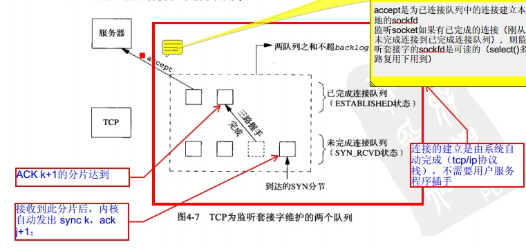

基于TCP的网络编程开发分为服务器端和客户端两部分, 本文将结合TCP网络连接实现原理, 从实现的角度进一步深入分析TCP网络通信过程;
<!--more-->
TCP(Transmission Control Protocol 传输控制协议)是一种面向连接的、可靠的、基于字节流的传输层通信协议。
使用 TCP/IP 协议的应用程序通常采用系统提供的编程接口: UNIX BSD 的套接字接口(Socket Interfaces) 以此来实现网络进程之间的通信。 就目前而言, 几乎所有的应用程序都是采用 socket。

那什么是 socket 呢？ socket 起源于 UNIX, 而 UNIX/Linux 基本哲学之一就是「一切皆文件」, 都可以用「open → write/read → close」模式来操作。 socket 其实就是该模式的一个实现, socket 即是一种特殊的文件, 一些 socket 函数就是对其进行的操作。

# TCP通信过程
基于 TCP 的网络编程开发分为服务器端和客户端两部分, 常见的核心步骤和流程如下,


上图完整描述了一次socket网络通信的全过程, 从open(tcp中的三次握手建立连接) --> write/read(数据交互) --> close(tcp四次挥手关闭连接);

# 套接字接口
套接字接口是一组函数, 由操作系统提供, 用以创建网络应用。

> **套接字接口的起源**
套接字接口是加州大学伯克利分校的研究人员在 20 世纪 80 年代早起提出的。
伯克利的研究者使得套接字接口适用于任何底层的协议, 第一个实现就是针对 TCP/IP 协议, 他们把它包括在 Unix 4.2 BSD 的内核里, 并且分发给许多学校和实验室。
这在因特网的历史成为了一个重大事件。
—— 《深入理解计算机系统》

从 Linux 内核的角度来看, 一个套接字就是通信的一个端点。
从 Linux 程序的角度来看, 套接字是一个有相应描述符的文件。
普通文件的打开操作返回一个文件描述字, 而 socket() 用于创建一个 socket 描述符, 唯一标识一个 socket。
这个 socket 描述字跟文件描述字一样, 后续的操作都有用到它, 把它作为参数, 通过它来进行一些操作。

## socket 函数
该函数会返回一个套接字描述符(socket descriptor), 但是该描述符仅是部分打开的, 还不能用于读写。
如何完成打开套接字的工作, 取决于我们是客户端还是服务器。

### 函数原型
```C++
#include <sys/socket.h>

int socket(int domain, int type, int protocol);
```

### 参数说明
**domain**: 
协议域, 决定了 socket 的地址类型, 在通信中必须采用对应的地址。
常用的协议族有: `AF_INET`(ipv4地址与端口号的组合)、`AF_INET6`(ipv6地址与端口号的组合)、`AF_LOCAL`(绝对路径名作为地址)。
该值的常量定义在 `sys/socket.h` 文件中。

**type**:
指定 socket 类型。
常用的类型有: `SOCK_STREAM`、`SOCK_DGRAM`、`SOCK_RAW`、`SOCK_PACKET`、`SOCK_SEQPACKET`等。
其中 `SOCK_STREAM` 表示提供面向连接的稳定数据传输, 即 TCP 协议。
该值的常量定义在 `sys/socket.h` 文件中。

**protocol**:
指定协议。
常用的协议有: `IPPROTO_TCP`(TCP协议)、`IPPTOTO_UDP`(UDP协议)、`IPPROTO_SCTP`(STCP协议)。
当值位 0 时, 会自动选择 `type` 类型对应的默认协议。

## bind 函数
由服务端调用, 把一个地址族中的特定地址和 socket 联系起来。

### 函数原型
```c++
#include <sys/socket.h>

int bind(int sockfd, const struct sockaddr *addr, socklen_t addrlen);
```

### 参数说明
**sockfd**:
即 socket 描述字, 由 socket() 函数创建。

***addr**: 
一个 `const struct sockaddr` 指针, 指向要绑定给 `sockfd` 的协议地址。
这个地址结构根据地址创建 socket 时的地址协议族不同而不同, 例如 ipv4 对应 `sockaddr_in`, ipv6 对应 `sockaddr_in6`.
这几个结构体在使用的时候, 都可以强制转换成 `sockaddr`。
下面是这几个结构体对应的所在的头文件: 
1. `sockaddr`:  `sys/socket.h`
2. `sockaddr_in`:  `netinet/in.h`
3. `sockaddr_in6`:  `netinet6/in.h`

> _in 后缀意义: 互联网络(internet)的缩写, 而不是输入(input)的缩写。

## listen 函数
当socket函数创建一个套接口时, 它被假设为一个主动套装口, 也就是说, 它是一个将调用connet发起连接的客户套接口。listen函数把一个未连接的套接口转换成一个被动套接口, 指示内核应接受指向该套接口的连接请求。根据TCP状态转换图, 调用listen导致套接口从CLOSED状态转换到LISTEN状态;

listen函数的第二个参数规定了内核应该为相应套接口排队的最大连接个数, 一般为以下两个队列的大小之和, 即未完成三次握手队列 +  已经完成三次握手队列;

### 函数原型
```C++
#include <sys/socket.h>
int listen(int sockfd, int backlog);
```

### 参数说明
**sockfd**:
即 socket 描述字, 由 socket() 函数创建。

**backlog**:
指定在请求队列中的最大请求数, 进入的连接请求将在队列中等待 accept() 它们。

为了更好的理解backlog参数, 我们必须认识到内核为任何一个给定的监听套接口维护两个队列: 
1. `未完成连接队列`(incomplete connection queue), 每个这样的SYN分节对应其中一项: 已由某个客户发出并到达服务器, 而服务器正在等待完成相应的TCP三路握手过程。这些套接口处于SYN_RCVD状态。
2. `已完成连接队列`(completed connection queue), 每个已完成TCP三路握手过程的客户对应其中一项。这些套接口处于ESTABLISHED状态。



当来自客户的SYN到达时, TCP在未完成连接队列中创建一个新项, 然后响应以三路握手的第二个分节: 服务器的SYN响应, 其中稍带对客户SYN的ACK(即SYN+ACK)。这一项一直保留在未完成连接队列中, 直到三路握手的第三个分节(客户对服务器SYN的ACK)到达或者该项超时为止(曾经源自Berkeley的实现为这些未完成连接的项设置的超时值为75秒)。如果三路握手正常完成, 该项就从未完成连接队列移到已完成连接队列的队尾。当进程调用accept时, 已完成连接队列中的队头项将返回给进程, 或者如果该队列为空, 那么进程将被投入睡眠, 直到TCP在该队列中放入一项才唤醒它。

Linux系统tcp /ip协议栈有个选项可以设置未连接队列大小限制`tcp_max_syn_backlog`, 此外, Linux 系统中提供`somaxconn`这个参数，它定义了系统中每一个端口最大的监听队列的长度,这是个全局的参数, 默认值为128;

```shell
~ » cat /proc/sys/net/ipv4/tcp_max_syn_backlog
128
~ » cat /proc/sys/net/core/somaxconn 
128
```

## connect 函数
由客户端调用, 与目的服务器的套接字建立一个连接。

### 函数原型
```C++
#include <sys/socket.h>
int connect(int clientfd, const struct sockaddr *addr, socklen_t addrlen);
```

### 参数说明
**clientfd**:
目的服务器的 socket 描述符

***addr**:
一个 `const struct sockaddr` 指针, 包含了目的服务器 IP 和端口。

**addrlen**: 
协议地址的长度, 如果是 ipv4 的 TCP 连接, 一般为 `sizeof(sockaddr_in)`;

## accept 函数
服务器调用, 等待来自客户端的连接请求。
当客户端连接, accept 函数会在 `addr` 中会填充上客户端的套接字地址, 并且返回一个已连接描述符(connected descriptor), 这个描述符可以用来利用 Unix I/O 函数与客户端通信。

### 函数原型
```C++
#indclude <sys/socket.h>
int accept(int listenfd, struct sockaddr *addr, int *addrlen);
```

### 参数说明
**listenfd**:
服务器的 socket 描述字, 由 socket() 函数创建。

***addr**:
一个 `const struct sockaddr` 指针, 用来存放提出连接请求客户端的主机的信息

***addrlen**:
协议地址的长度, 如果是 ipv4 的 TCP 连接, 一般为 `sizeof(sockaddr_in)`。

## close 函数
在数据传输完成之后, 手动关闭连接。

### 函数原型
```C++
#include <sys/socket.h>
#include <unistd.h>
int close(int fd);
```

### 参数说明
**fd**:
需要关闭的连接 socket 描述符

## 网络 I/O 函数
当客户端和服务器建立连接后, 可以使用网络 I/O 进行读写操作。
网络 I/O 操作有下面几组: 
1. read()/write()
2. recv()/send()
3. readv()/writev()
4. recvmsg()/sendmsg()
5. recvfrom()/sendto()

最常用的是 read()/write()
他们的原型是: 

```C++
ssize_t read(int fd, void *buf, size_t count);
ssize_t write(int fd, const void *buf, size_t count);
```

# 总结
- 对TCP通信过程进行了完整的分析;
- 详细分析了TCP Socket通信过程中各个函数的功能，参数描述; 
- 详细分析了listen函数中backlog参数值的作用;
